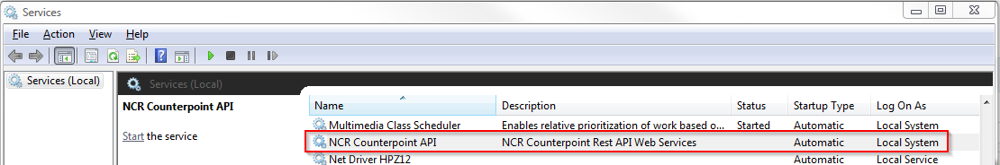
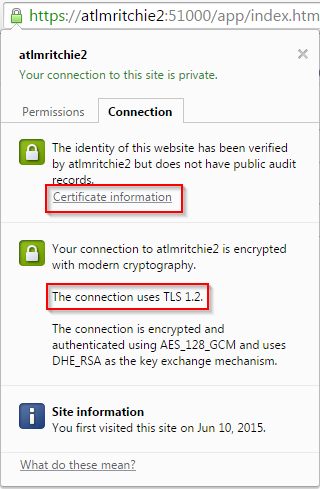
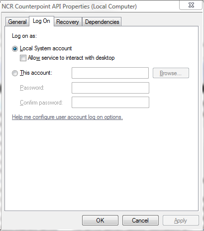

# Installing the NCR Counterpoint API

Installing the NCR Counterpoint API server is simple: run the .msi installer on the machine you wish to be the API Server. By default, the API server will install to `C:\Program Files (x86)\NCR\Counterpoint API`. This path can be changed during the install process if needed.

The latest API installation package can be downloaded via FTP from:

`files165.cyberlynk.net`

Please contact NCR or your NCR Counterpoint partner for credentials to download the API.

When the install completes, the server should be up and running on the default port (52000). The API installs as a windows service, and can be found under the name "NCR Counterpoint API" in the services console:

To verify the API Server is working correctly, you can try accessing it from a browser on the local machine at `https://<machine_name>:<port>/app/index.htm#/login`. This will load the login page to the NCR Counterpoint API Management console. If the service does not respond, please ensure it's running by checking the services console (`services.msc`). The only problem we've typically seen with the server not starting or responding is if the port being used by the API server is already used by another process. If this is the case, you can either stop or remove the other process, or change the port that the server is using by editing the `CPAPI.Console.exe.config` file. 

**NOTE** If you change the port that the API Server is using, you will need to unbind your SSL certificate and rebind it to the new port (or install a new certificate and bind it to the new port), otherwise, the SSL certficiate will break and cause issues accessing the server. 

If you have problems accsesing the NCR Counterpoint Admin Console, please see the [troubleshooting wiki page](https://github.com/NCRCounterpointAPI/APIGuide/wiki/Troubleshooting) for help.

Once you've verified the server is running, you can move on to configuring the server.

## Certificates and SSL
By default, the installer will generate and install a self-signed SSL certificate issued to the name of the machine the API Server is being installed on. This certificate will be bound to the port that the server is initially configured to use. This will allow API calls to be made on the local network using the format `https://<machine_name>:<port>`.

**NOTE** Since the default certificate we install is self-signed, browsers may give warnings, or even deny access to the server since it can't verify the authenticity of the certificate. This can be addressed by adding an exception in the browser (this varies by browser) or installing the public certficate as a "Trusted Root Certification Authority" on the client machine. To configure your Chrome browser to always accept a certain self-signed certificate, see [this article](http://superuser.com/questions/632059/how-to-add-a-self-signed-certificate-as-an-exception-in-chrome)

If needed, a signed certificate can be purchased from a certified trusted issuer and installed in place of the default self-signed certificate. The process is generally identical to purchasing and installing certificates for any other web server:
- Purchase a signed certificate from a certified issuer.
- Install the private certificate on the API server, into the Local Machine certificate store.
- Stop the API service.
- Unbind the self-signed certificate from the port being used by the API server.
- Bind the new signed certificate to the port being used by the API server.
- Start the API service.

[This](https://msdn.microsoft.com/en-us/library/ms733791(v=vs.110).aspx) MSDN page describes how to bind and unbind certificates from ports.

## SSL and TLS
Recently, several exploits have been found and publicized that makes many older encryption schemes used by SSL vulnerable. For a description of TLS encryption schemes and recent exploits against them, please see [this](https://en.wikipedia.org/wiki/Transport_Layer_Security) Wikipedia article. The TLS encryption scheme used is determined via a negotiation between the client and server called an [SSL Handshake](https://support.microsoft.com/en-us/kb/257591?wa=wsignin1.0). Because of this, for maximum security we recommend requiring TLS1.2, but depending on a user's individual needs, this requirement can cause some incompatibility issues with some older browsers, so it's ultimately up to the user to determine the minimum encryption scheme that will be supported.

The encryption schemes are controlled at the windows level, not by the individual application, and the API installation does not do anything to modify this. Making this change is outside of the scope of this document, but in general the approach is to modify the registry to disable older schemes (SSL 3.0, TLS 1.0, TLS 1.1) and enable TLS 1.2. [This](https://support.microsoft.com/en-us/kb/245030) MSDN article should get you started.

To see what encryption scheme (and certificate) is being used, you can visit the login page for the API Management Console (`https://<server_name>:<port>/app/index.htm#/login`), the use the browser to view certificate information. Using Chrome, I clicked on the lock in the address bar (next to the login URL above), then clicked the "connection" tab on the resulting dialog:

This shows that my connection is using TLS 1.2, and I can click "Certificate Information" to view more information about the SSL certificate protecting this site.

## Directory structure
Below is a description of the directory structure and key files and locations for the API server. This structure all exists underneath the installation folder, which is assumed below to be the default of `C:\Program Files (x86)\NCR\Counterpoint API`.

Folder | Description | Contents
------ | ----------- | --------
C:\Program Files (x86)\NCR\Counterpoint API | Installation folder | All binaries exist in the installation folder. These files should typically never need to be touched, with the exception of CPAPI.Console.exe.config, which may be edited for things such as configuring the port the server is listening on.
APIKeys | API Key folder | This folder contains API keys for client applications that need access to the system. Developers of 3rd party applications using the API should put their XML key files (not the plain text TXT file) in this folder in order to allow their application to access this server.
App_Data | System data folder | This folder contains the sysadmin.sqlite file, which is a system SQLite database managed internally by the API server. This database holds information like TLD and database connection information, sysadmin login information, and other system level data needed by the API server. The sysadmin.sqlite file will be automatically recreated if deleted, but of course all information stored in the file would be lost, such as links to Counterpoint companies, sysadmin users, etc. All company level information would remain intact once a link to a Counterpoint database is re-established since that data is stored in the Counterpoint database and TLD.
Logfiles | Log folder | This folder holds the log files for the API server (CPAPI.log). There is one logfile for the API server, and by default it is configured as a rolling log file, so each day the log file for the day will be archived as CPAPIyymmdd.log. By default a maximum of 10 days of log files will be kept. The API server uses standard Log4Net logging so the log file can be reconfigured by editing the `<log4net>` node of CPAPI.Console.exe.config per standard log4net specifications.
x64 | 64bit folder | This folder holds binary files that are needed for operation on 64bit machines. There should never be a need to be touched.
x86 | 32bit folder | This folder holds binary files that are needed for operation on 32bit machines. There should never be a need to be touched.

## Permissions
As a web server, all non-administrative functionality should be accessed through the REST API itself, or the web based NCR Counterpoint API Management Console. Windows access to installation folder (and ideally the entire machine hosting the API Server) should be locked down and restricted to administrative access only.

In addition, the NCR Counterpoint API Server needs to be able to access the company specific data it provides via the API, which includes the following:
- Read/Write access to the TLD and all subfolders of the TLD of the companies that are accessible via the API.
- Database administrative access to the Counterpoint databases that are accessible via the API.

## Service Account
By default, the NCR Counterpoint API Service will run under the LocalSystem account, as shown on the "Log On" tab of the property page for the service:

This can be changed if needed using the dialog above. Whatever account that is configured for the service to run under is the account that will need to be granted permissions to the afore mentioned TLD folder, as well as the account that will be used to connect to databases that are configured to use integrated security. Please note that the API server can be configured with different database credentials than those in the companies.ini folder, so it is not necessary to grant database admin rights to the database connection in companies.ini.

## Changes to Counterpoint databases
Currently, the only change the API server will make to a Counterpoint database is to add a table called "KeyValueData" to the database. This is why the server needs database administrative access. The table will be added whenever it's found to be missing. The structure of the table is:

Column | Datatype | Description
------ | -------- | -----------
Id | int (Auto-increment) | A unique Id for the object being stored.
Key | varchar(8000) | A unique identifier for the object being stored. For instance, if it's a user role, the name of the user role.
Type | varchar(8000) | The type of data being stored in the "Value" column. This is automatically filled in by the API Server based on the .NET type being stored, and is used to filter out all objects of a given type from the table.
Value | varchar(max) | The object being stored. This is a JSON serialization of the object.

This table is used as a generic storage location for data specific to the API, such as API users (that are tied to Counterpoint SY_USR users), and API roles. The intent is to continue to store company specific data in the Counterpoint company databases, while system/administrative level data is stored in the SQLite database. This also ensures that if a Counterpoint database is ever removed from an API server for some reason, and linked back at a later time (or moved to a different API server), that the proper data continues to live and persist with Counterpoint.

The KeyValueData table stores data objects that are serialized into JSON strings, similar to how a NoSQL database stores data. This allows for very quick reading and writing of data, or accessing of data by Id or Name, but it is not ideal for querying data filtered by specific attributes (such as finding all roles with access to "GET /Customers"). It also allows for easy storage/retrieval of data without having to make data model changes, reducing friction for users and making things easier for developers. However, we currently have little need for that when working with data in this table, and typically the volume of data in the table will be small enough that performance is not a major concern.
